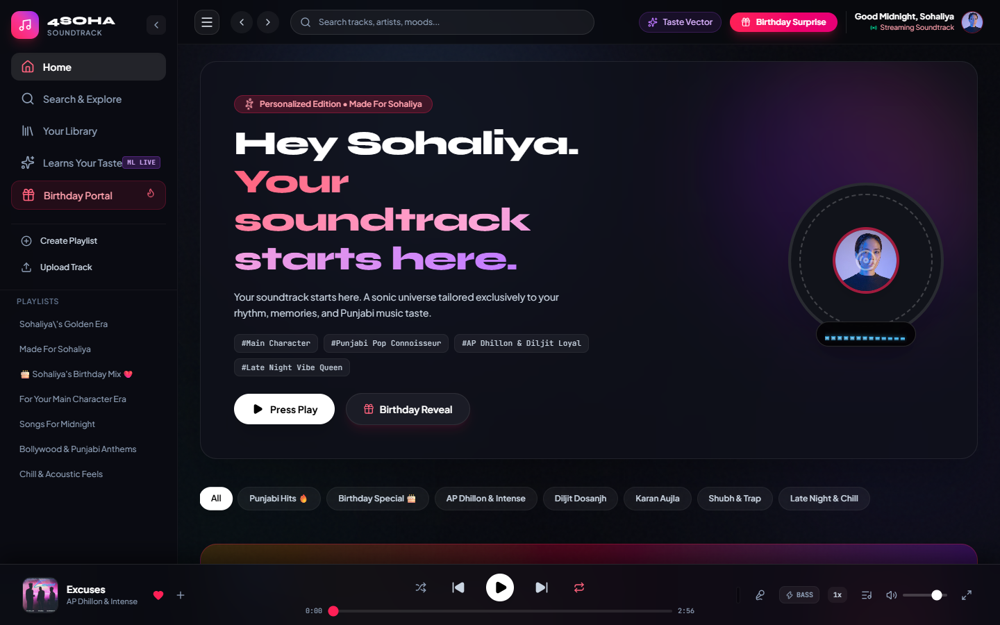
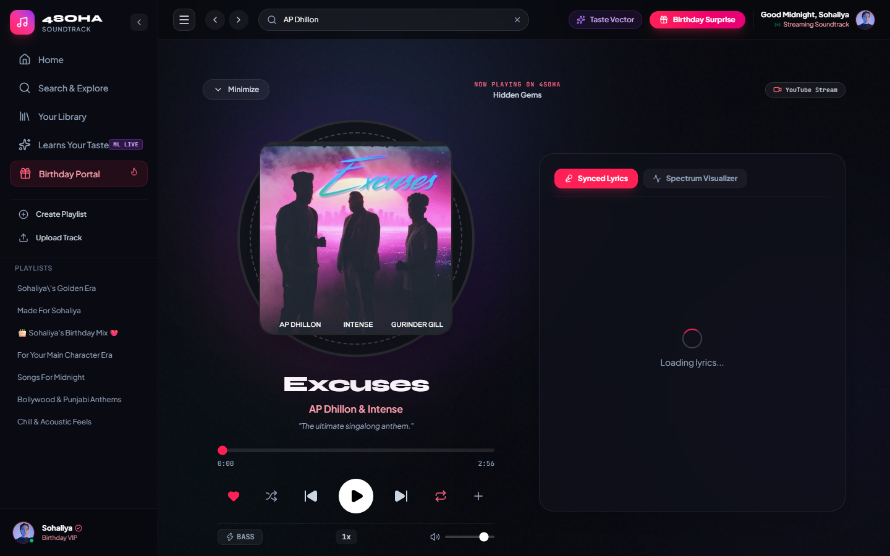
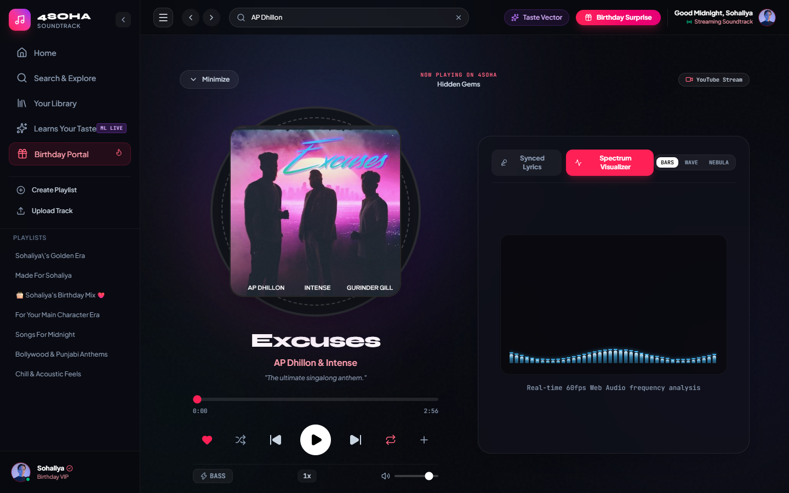
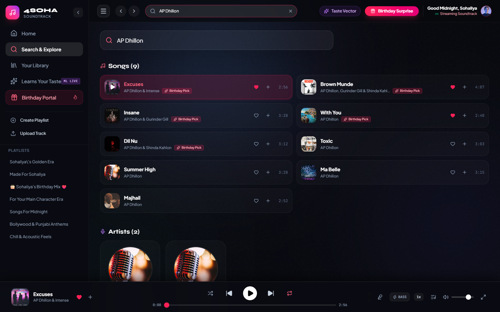
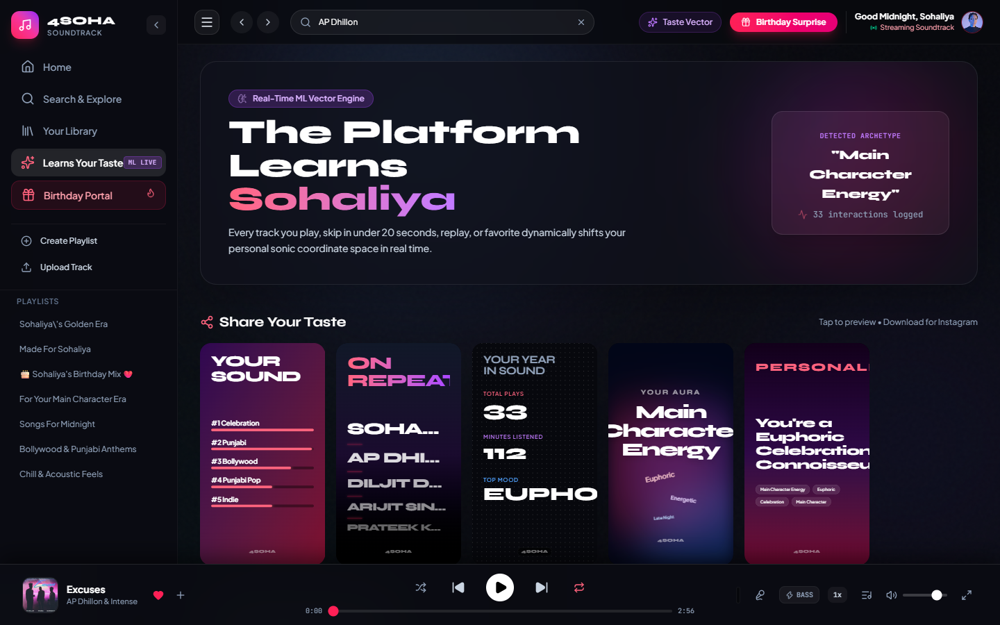
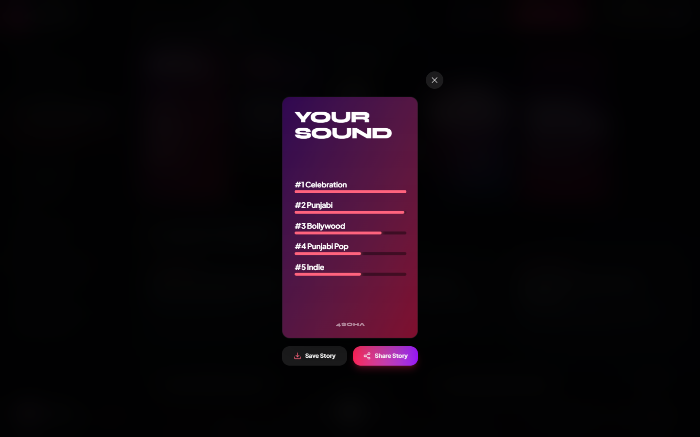
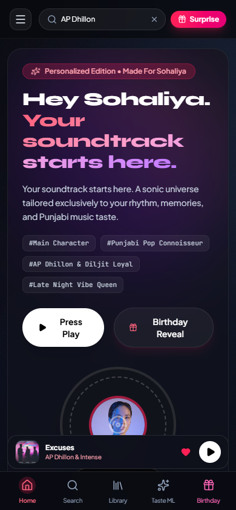

# 4SOHA (Musically) — Next-Generation Web Audio Streaming Platform

A high-performance music streaming platform and interactive audio suite built with **React 19**, **TypeScript**, **Tailwind CSS v4**, **Web Audio API**, **LRCLIB API**, and an $O(\log N)$ **synchronized lyrics engine**.

---

## 📸 Visual Showcase & Screenshots

### 1. Home Dashboard & Curated Anthems
> Dynamic glassmorphism shell featuring curated soundtrack worlds, trending anthems, and quick playback controls.



---

### 2. Full-Screen Now Playing & Synchronized Lyrics
> Real-time lyric synchronization powered by LRCLIB API. Features active line highlighting, smooth auto-scrolling, and interactive click-to-seek navigation.



---

### 3. Hardware-Accelerated 60fps Audio Visualizer
> Real-time frequency analysis with multi-mode visualizer physics (Bars, Wave, Nebula) reacting to track BPM, energy, and danceability.



---

### 4. Sonic Exploration & Genre Matrix
> Instant real-time search across 217+ verified tracks spanning Punjabi hits, Bollywood anthems, Global Top Charts, and Indie acoustic melodies.



---

### 5. ML Taste Profile & Wrapped-Style Experience
> Multi-dimensional vector space analyzing listening affinities, top genres, artist resonance, and sonic archetypes with shareable story cards.



---

### 6. Instagram Story Card Exporter (1080×1920)
> Client-side high-resolution (9:16) image generation using `html-to-image` and React Portals with native Web Share API support.



---

### 7. Adaptive Mobile Experience
> Fully responsive layout with ergonomic slide-out drawer, bottom tab bar, and persistent mini-player capsule designed for one-handed mobile use.

<p align="center">
  
</p>

---

## 🌟 Key Architecture & Capabilities

### 1. Multi-Provider Playback Abstraction Layer (`PlaybackManager`)
A unified audio playback routing engine that separates metadata resolution from stream execution:
* **YouTube IFrame API Audio Provider (`YouTubeAudioEngine`)**: Streams full-length official studio recordings directly with zero DRM circumvention or unauthorized scraping.
* **HTML5 Direct Audio Provider (`AudioEngine`)**: Powers low-latency local studio master files, custom user audio uploads, and offline fallbacks.
* **Dynamic Provider Switching**: Seamless hot-swapping between direct master streams and full official streaming sources with unified playback state management.

```text
User Action (Select Track / Seek / Play)
                 ↓
      PlaybackManager (Router)
       ├── YouTubeAudioEngine (Full Official Stream)
       └── HTML5AudioEngine (Direct Studio Master / Custom Uploads)
                 ↓
      Active Playback Stream (Position, Duration, Capability: FULL)
                 ↓
      LyricsSyncEngine (Binary Search O(log N))
                 ↓
      Real-Time UI Highlighting & 60fps Audio Visualizer
```

---

### 2. Precision Synchronized Lyrics Engine (`LyricsProvider` & `LyricsSyncEngine`)
* **Real-time LRCLIB API Client**: Dynamically queries timestamped lyrics with in-memory caching and clean search normalization.
* **$O(\log N)$ Binary Search Lookup**: Derives active lyric lines directly from the authoritative playback clock in milliseconds, eliminating drift and interval lag.
* **Deterministic Seek Synchronization**: Scrubbing the audio seeker or skipping tracks recalculates active line positions instantaneously.
* **Interactive Click-to-Seek**: Clicking any timestamped lyric line immediately seeks the audio player to that exact millisecond.
* **Auto-Scroll with Manual Override**: Temporarily halts automatic viewport scrolling when the user manually scrolls, with a 1-click **"Resume Sync"** badge.

---

### 3. Web Audio API DSP & 60fps Visualizer (`VisualizerCanvas`)
* **Hardware-Accelerated Canvas**: High-DPI Retina scaling (`window.devicePixelRatio`) with GPU composite layering.
* **Visualizer Modes**:
  * **Bars**: Multi-band frequency analysis with peak cap gravity falloff physics and neon glow gradients.
  * **Wave**: Dual-layer harmonic waveform with glowing ambient aura.
  * **Nebula**: Radial orbital particle ring responding to low-frequency bass kicks.
* **Procedural Simulation Mode**: Smoothly computes harmonic frequencies based on real track BPM, energy, and danceability during cross-origin playback.
* **Real-time DSP Audio FX**: Interactive low-shelf BiquadFilter bass boost and dynamic playback speed switcher (0.8x – 1.5x).

---

### 4. Vector-Based Recommendation & Taste Profiling Engine
* **Cosine Similarity Scoring**: Computes cosine distance across 5-dimensional audio vectors (Danceability, Energy, Valence, Acousticness, Vibe Score, BPM).
* **Dynamic Taste Profile**: Continuously evolves genre and artist affinity vectors based on real-time listening events (plays, skips, completions, likes).
* **Deterministic Catalog Validator**: Audits track metadata, provider capabilities, and lyric intervals with diagnostic reporting.

---

### 5. Instagram-Shareable Story Cards (`TasteCard` & `CardExporter`)
* **Native 9:16 (1080×1920) Rendering**: 5 Gen Z visual variants (*Your Sound*, *On Repeat*, *Your Year in Sound*, *Your Aura*, *Music Personality*).
* **Modern Color Support**: Utilizes `html-to-image` for pristine rendering of Tailwind CSS v4 OKLCH colors and glassmorphic backdrops.
* **Direct Export & Sharing**: 1-click high-resolution PNG download and Web Share API integration.

---

### 6. Responsive UI/UX & Glassmorphic Design System
* **Collapsible Desktop Navigation**: Three-line hamburger menu toggle transitioning between full 260px sidebar and a sleek 72px icon rail.
* **Mobile Slide-out Drawer & Mini-Player Capsule**: Ergonomic touch targets (min 44x44px) with safe-area spacing and zero button cutoffs.
* **Dynamic Ambient Lighting**: Analyzes album artwork palettes in real time to dynamically tint backdrop blur meshes and glow accents.

---

## 🛠️ Technology Stack

| Layer | Technology |
|---|---|
| **Frontend Framework** | React 19, TypeScript |
| **Styling & Tokens** | Tailwind CSS v4, Lucide Icons, Glassmorphism CSS |
| **State Management** | Zustand (Global Player, Library, and UI Stores) |
| **Audio Processing** | Web Audio API (`AudioContext`, `AnalyserNode`, `BiquadFilterNode`) |
| **Lyrics Service** | LRCLIB REST API with memory caching & LRC parser |
| **Image Generation** | `html-to-image` (Canvas & SVG foreignObject serialization) |
| **Testing & Tooling** | Vitest, Vite, Playwright |

---

## 🚀 Getting Started

### Prerequisites
* **Node.js**: `v18.0.0` or later
* **npm** or **pnpm** or **yarn**

### Installation

1. **Clone the repository**:
   ```bash
   git clone https://github.com/harshvshah12/Musically.git
   cd Musically
   ```

2. **Install dependencies**:
   ```bash
   npm install
   ```

3. **Start the development server**:
   ```bash
   npm run dev
   ```
   Open [http://localhost:5173](http://localhost:5173) in your browser.

4. **Run test suite**:
   ```bash
   npm run test
   # or
   npx vitest run
   ```

5. **Build for production**:
   ```bash
   npm run build
   ```

---

## 📄 Documentation

For full architectural blueprints, data flow diagrams, and subsystem design specifications, see [architecture.md](architecture.md).

---

## 📜 License

This project is licensed under the [MIT License](LICENSE).
